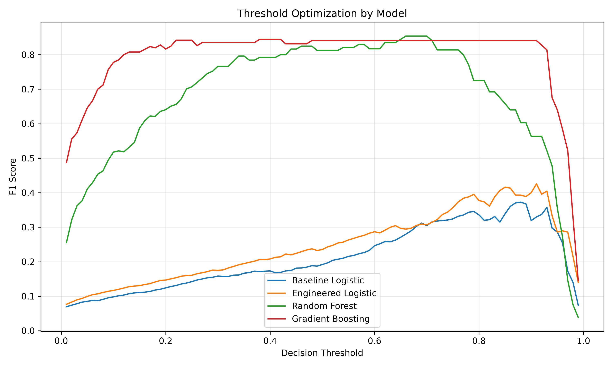

# AI4I Machine Failure Prediction

[](https://github.com/ardaatikk/ai4i-machine-failure-prediction/actions/workflows/ci.yml)
[](https://www.python.org/)
[](LICENSE)

An end-to-end machine learning project for predicting machine failures from operational and sensor measurements using the AI4I 2020 Predictive Maintenance Dataset.

The project covers the complete ML workflow: data acquisition, preprocessing, feature engineering, model comparison, decision-threshold optimization, final evaluation, FastAPI inference, automated testing, and continuous integration.

## Overview

The objective is to predict whether a machine is likely to experience a failure based on six input variables:

- Product quality type (`L`, `M`, `H`)
- Air temperature
- Process temperature
- Rotational speed
- Torque
- Tool wear

Several classification approaches are compared, starting from a Logistic Regression baseline and progressing to tree-based ensemble models.

The final model is a Random Forest classifier with an optimized decision threshold selected using validation data.

## Key Results

Final performance on the held-out test set:

| Metric | Score |
|---|---:|
| Accuracy | 0.9953 |
| Precision | 1.0000 |
| Recall | 0.8627 |
| F1 Score | 0.9263 |
| ROC-AUC | 0.9869 |
| PR-AUC | 0.9365 |

The final decision threshold is **0.66**.

Confusion matrix on 1,500 test samples:

| | Predicted Normal | Predicted Failure |
|---|---:|---:|
| Actual Normal | 1449 | 0 |
| Actual Failure | 7 | 44 |

The test set contains 51 failure samples.

## Machine Learning Pipeline

The project follows the following workflow:

```text
UCI AI4I Dataset
        |
        v
Data Loading & Validation
        |
        v
Preprocessing
        |
        v
Train / Validation / Test Split
        |
        v
Feature Engineering
        |
        v
Model Training
        |
        v
Validation-Based Model Comparison
        |
        v
Threshold Optimization
        |
        v
Final Test Evaluation
        |
        v
FastAPI Inference Service
```

The test set is kept separate from model and threshold selection and is used for final evaluation.

## Dataset

This project uses the **AI4I 2020 Predictive Maintenance Dataset** from the UCI Machine Learning Repository.

The model uses the following base features:

| Feature | Description |
|---|---|
| `Type` | Product quality category: L, M, or H |
| `Air temperature [K]` | Air temperature in Kelvin |
| `Process temperature [K]` | Process temperature in Kelvin |
| `Rotational speed [rpm]` | Machine rotational speed |
| `Torque [Nm]` | Applied torque |
| `Tool wear [min]` | Tool wear duration |

### Data Splitting

The dataset is divided into:

- **70% training**
- **15% validation**
- **15% test**

Stratified splitting is used to preserve the machine-failure rate across all three subsets. A fixed random state (`42`) is used for reproducibility.

The validation set is used for model and decision-threshold selection, while the test set remains held out until final evaluation.

Identifier columns (`UDI`, `Product ID`) are excluded from the feature set. Failure-type indicator columns (`TWF`, `HDF`, `PWF`, `OSF`, `RNF`) are also removed because they directly encode failure outcomes and would introduce target leakage.

The raw dataset is not committed to the repository. It can be downloaded using:

```bash
python -m src.data.download
```

## Feature Engineering

Three additional features are derived from the original measurements:

### Temperature Difference

Difference between process and air temperature.

### Power Proxy

A feature derived from rotational speed and torque to represent the machine's mechanical operating load.

### Tool Wear-Torque Interaction

An interaction feature combining tool wear and torque to represent the effect of accumulated wear under mechanical load.

Feature engineering is implemented in:

```text
src/features/engineering.py
```

## Model Comparison

Four models are evaluated:

| Model | Validation F1 | Precision | Recall | Best Threshold |
|---|---:|---:|---:|---:|
| Baseline Logistic Regression | 0.3725 | 0.3725 | 0.3725 | 0.88 |
| Engineered Logistic Regression | 0.4255 | 0.4651 | 0.3922 | 0.91 |
| Random Forest | 0.8539 | 1.0000 | 0.7451 | 0.66 |
| Gradient Boosting | 0.8444 | 0.9744 | 0.7451 | 0.38 |

Random Forest achieved the highest validation F1 score and was selected as the final model.

## Threshold Optimization

Instead of relying on the default classification threshold of `0.50`, decision thresholds from `0.01` to `0.99` are evaluated on the validation set.

The threshold maximizing validation F1 is selected independently for each model.

For the final Random Forest model:

```text
Threshold: 0.66
Precision: 1.0000
Recall:    0.7451
F1:        0.8539
```



Threshold selection is performed only on validation data. The held-out test set is used afterward for final evaluation.

## Final Evaluation

The selected Random Forest model and threshold are evaluated once on the held-out test set.

The complete machine-readable evaluation report is stored at:

```text
reports/final_evaluation.json
```

The final model correctly identifies 44 of 51 machine failures while producing no false positives on this test split.

## FastAPI Inference API

The trained model can be served through a FastAPI application.

Start the API with:

```bash
uvicorn api.main:app --reload
```

The interactive API documentation is available at:

```text
http://127.0.0.1:8000/docs
```

### Endpoints

- `GET /` — API metadata and endpoint information
- `GET /health` — service health and active model
- `POST /predict` — machine failure prediction

Example prediction request:

```json
{
  "product_quality": "L",
  "air_temperature_k": 303.3,
  "process_temperature_k": 311.3,
  "rotational_speed_rpm": 1350,
  "torque_nm": 48.1,
  "tool_wear_min": 32
}
```

Example response:

```json
{
  "prediction": 1,
  "label": "failure",
  "failure_probability": 0.9433333333333334,
  "threshold": 0.66,
  "model": "Random Forest"
}
```

Request and response validation is handled with Pydantic schemas.

## Installation

Clone the repository and enter the project directory:

```bash
git clone <repository-url>
cd ai4i-machine-failure-prediction
```

Create and activate a Python virtual environment, then install dependencies:

```bash
python -m venv .venv
source .venv/bin/activate

python -m pip install --upgrade pip
pip install -r requirements.txt
```

Download the dataset:

```bash
python -m src.data.download
```

Train the models:

```bash
python -m src.models.train
```

## Running the ML Pipeline

### Train models

```bash
python -m src.models.train
```

### Run threshold analysis

```bash
python -m src.models.threshold
```

### Evaluate the final model

```bash
python -m src.models.evaluate
```

### Inspect Random Forest feature importance

```bash
python -m src.models.inspect
```

### Start the inference API

```bash
uvicorn api.main:app --reload
```

## Testing

The project includes automated tests for:

- preprocessing and data contracts
- leakage prevention
- train/validation/test splitting
- feature engineering
- model builders
- API endpoints
- request validation
- model inference consistency
- model loading
- API-to-model feature conversion

Run the complete test suite with:

```bash
pytest -q
```

Current test suite:

```text
24 passed
```

## Continuous Integration

GitHub Actions runs the project in a clean Ubuntu environment on pushes and pull requests.

The CI workflow:

1. Checks out the repository
2. Sets up Python 3.11
3. Installs dependencies
4. Downloads the AI4I dataset
5. Trains the models from scratch
6. Runs the complete automated test suite

This verifies that the project can be reproduced without relying on locally generated datasets or trained model files.

## Project Structure

```text
.
├── .github/
│   └── workflows/
│       └── ci.yml
├── api/
│   ├── inference.py
│   ├── main.py
│   └── schemas.py
├── data/
│   ├── processed/
│   └── raw/
├── models/
├── reports/
│   ├── figures/
│   │   └── threshold_comparison.png
│   └── final_evaluation.json
├── src/
│   ├── data/
│   │   ├── analysis.py
│   │   ├── download.py
│   │   └── preprocessing.py
│   ├── features/
│   │   └── engineering.py
│   ├── models/
│   │   ├── builders.py
│   │   ├── config.py
│   │   ├── evaluate.py
│   │   ├── inspect.py
│   │   ├── threshold.py
│   │   └── train.py
│   └── utils/
│       └── config.py
├── tests/
│   ├── test_api.py
│   ├── test_features.py
│   ├── test_models.py
│   └── test_preprocessing.py
├── .gitignore
├── requirements.txt
└── README.md
```

Generated datasets and trained model files are intentionally excluded from version control.

## Technologies

Python, pandas, NumPy, scikit-learn, FastAPI, Pydantic, pytest, Matplotlib, joblib, Uvicorn, and GitHub Actions.

## Limitations

The project is based on a synthetic predictive-maintenance dataset and should not be interpreted as a production-ready industrial failure detection system.

Performance metrics reflect the specific AI4I dataset and train/validation/test split used in this project. Real-world deployment would require validation on representative production data, monitoring for data drift, and domain-specific cost analysis for false positives and false negatives.

## Future Improvements

Potential extensions include probability calibration, additional model families, model explainability endpoints, containerization, deployment, monitoring, and validation on real industrial telemetry data.